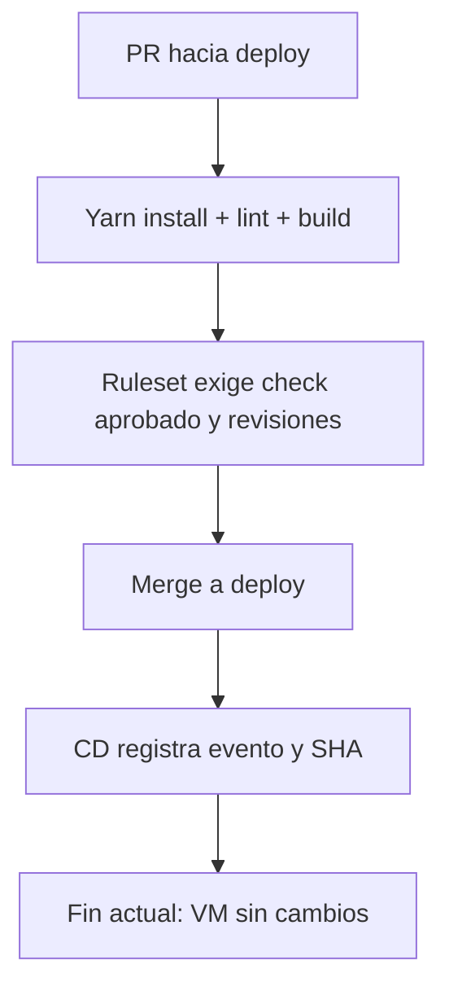

# CI y CD del frontend

## CI

El workflow `.github/workflows/ci.yml` corre en pull requests (incluidos los dirigidos a `deploy`), pushes a `development` y ejecuciones manuales. Usa Node.js 22 y Yarn 1.22.22, conforme al proyecto.

El check **Frontend lint and build** instala el lockfile con `yarn install --frozen-lockfile --non-interactive`, ejecuta ESLint sin permitir warnings y construye el frontend con `VITE_API_URL=/api`.

El proyecto actual usa JavaScript/JSX. ESLint verifica reglas de JavaScript y React, pero no realiza chequeo de tipos TypeScript; Vite tampoco. Para agregar ese requisito hay que incorporar TypeScript y una configuracion de tipos, o checkJs/JSDoc, corregir sus diagnosticos y ejecutar un comando typecheck antes del build. No se ha migrado el codigo en este cambio.

Esta primera version no ejecuta tests de navegador ni construye o arranca Nginx/Docker. No requiere backend ni secretos productivos. Un build exitoso no garantiza que los endpoints respondan en produccion.

### Prueba local

Desde la raiz del frontend, con Node.js 22 y Yarn 1.22.22:

```bash
yarn install --frozen-lockfile --non-interactive
yarn lint --max-warnings 0
VITE_API_URL=/api yarn build
```

Estos comandos comprueban los pasos locales, no los triggers o permisos de GitHub. Verificar el primer run en Actions al subir el workflow y abrir un PR.

## CD

`.github/workflows/cd.yml` se activa cuando se actualiza `deploy`, incluido un merge. Permite ejecucion manual sobre esa rama; otras ramas omiten el job. El boton manual requiere que el workflow exista en la rama predeterminada.

Actualmente solo registra evento y SHA en el resumen de Actions. No hace SSH, git pull, publicacion de imagen ni modifica la VM. Un check verde significa que funciono el disparador, no que se haya desplegado.

## Regla de merge

En GitHub, activar un ruleset para `deploy` con PR obligatorio y **Require status checks to pass**, seleccionando **Frontend lint and build**. Exigir la rama actualizada y configurar revisiones y bypass segun el equipo. El YAML no crea esta regla ni hace que CD espere a CI; un push directo permitido tambien dispara CD.



## Pendiente con el administrador

Definir conectividad privada (VPN/SSH o runner autorizado), permisos, secretos, despliegue del SHA exacto o imagen inmutable, healthcheck y rollback. Si se permiten bypasses, verificar explicitamente el candidato aprobado antes de desplegar. La construccion productiva debe recibir VITE_API_URL=/api, ya que Vite incorpora esa variable al compilar.
